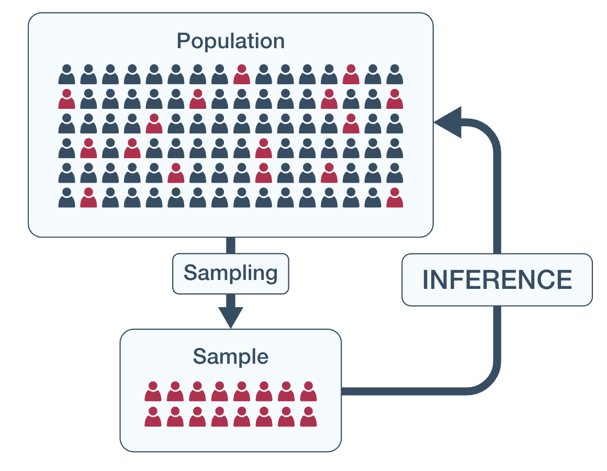
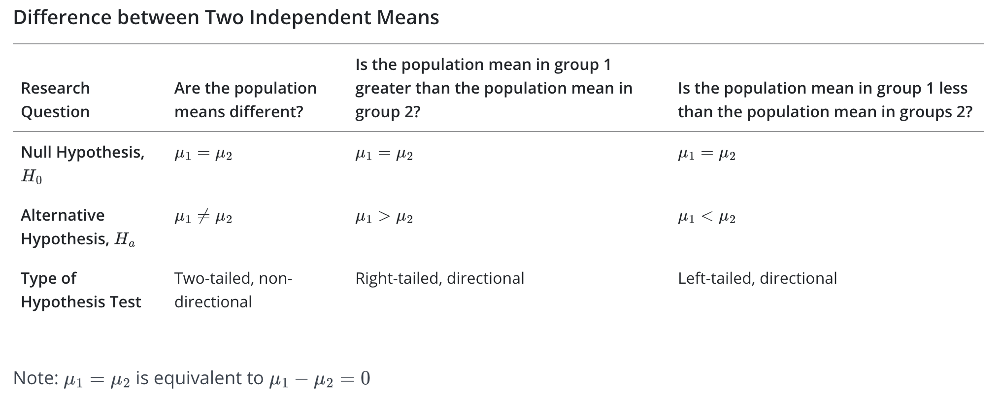
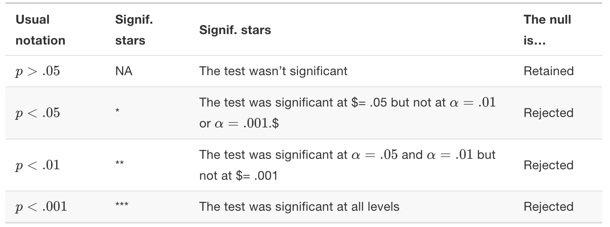

```{r setup, include=FALSE}
knitr::opts_chunk$set(echo = FALSE)
```

# Population and sample

{height=500px}

*Source* https://online.stat.psu.edu/stat200/lesson/1/1.2

# Statistical hypotheses

**Statistical hypotheses** must be mathematically precise, and they must correspond to specific claims about the characteristics of the data generating mechanism (i.e., the population)

*Source* https://learningstatisticswithr.com/book/hypothesistesting.html

# Hypothesis testing

The goal of hypothesis testing is to determine whether there is enough evidence to support a certain hypothesis about your data 

</br>
We formulate two hypotheses:

- the null hypothesis ($H_0$): the statement that there is not a difference in the population(s)
- the alternative hypothesis ($H_1$): the statement that there is some difference in the population(s)

> *Interpretation*:
>
> - we can reject the null hypothesis
> - we fail to reject the null hypothesis (retain $H_0$)

*Sources* https://www.jmp.com/en_ch/statistics-knowledge-portal/one-way-anova.html https://online.stat.psu.edu/stat200/lesson/5/5.2

# p-value

*p-value* is a statistical measurement used to validate a hypothesis against observed data

- p-value measures the probability of obtaining the observed results, assuming that the null hypothesis is true
- given that the null hypothesis is true, the probability of obtaining a sample statistic as extreme or more extreme than the one in the observed sample, in the direction of the alternative hypothesis 
- a hypothesis test is considered to be statistically significant when the p-value is less than or equal to the level of significance, also known as the alpha ($\alpha$) level
- the level of significance ($\alpha$) is the percentage of risk we are willing to take while rejecting the null hypothesis

*Sources* https://online.stat.psu.edu/stat200/lesson/5/5.1 https://www.investopedia.com/terms/p/p-value.asp https://towardsdatascience.com/how-to-understand-p-value-in-layman-terms-80a5cc206ec2


# p-value

- The p-value is used to determine if the outcome of an experiment is statistically significant
- A low p-value means that assuming the null hypothesis is true, there is a very low likelihood that this outcome was a result of luck
- A high p-value means that assuming the null hypothesis is true, this outcome was very likely

*Source* https://towardsdatascience.com/how-to-understand-p-value-in-layman-terms-80a5cc206ec2

# p-value

{height=500px}

*Source* https://towardsdatascience.com/how-to-understand-p-value-in-layman-terms-80a5cc206ec2

# Errors in decision

- *Type I error* - Rejecting the null when it was true
- *Type II error* - Failure to reject a false null hypothesis is called

> Level of significance ($\alpha$) — the percentage of risk we are willing to take while rejecting the null hypothesis or the Type I error rate

{height=300px}

*Source* https://towardsdatascience.com/how-to-understand-p-value-in-layman-terms-80a5cc206ec2

# How to test

*t-test* (also known as Student's t-test) is a tool for evaluating the *means* of one or two populations using hypothesis testing

- t-test may be used to evaluate whether a single group differs from a known value (a one-sample t-test)
- whether two groups differ from each other (an independent two-sample t-test)
- whether there is a significant difference in paired measurements (a paired, or dependent samples t-test)

*Source* https://www.jmp.com/en_ch/statistics-knowledge-portal/t-test.html


# Choose an appropriate t-test

:max_bytes(150000):strip_icc():format(webp)/ttest2-147f89de0b384314812570db74f16b17.png){height=500px}

*Source* https://www.investopedia.com/terms/t/t-test.asp


# One-sample t-test

## Hypothesis testing

- $H_0$ (null hypothesis) - the sample mean is the same as population (sample data represent the population)
- $H_1$ (alternative hypothesis) - otherwise

$$t=\cfrac{\bar{X}-\mu}{\frac{s}{\sqrt{n}}}$$

- $\bar{X}$ - sample mean
- $\mu$ - theoretical mean (population mean)
- $s$ - sample standard deviation
- $n$ - number of observations


# Paired two-sample t-test

$$t=\cfrac{\bar{X_1}-\bar{X_2}}{\frac{s_{D}}{\sqrt{n}}}$$

- $\bar{X_1}$ and $\bar{X_2}$ - means of two samples
- $s_D$ - standard deviation of the differences in paired data
- $n$ - number of observations (the same in two samples)

# Independent two-sample t-test
## Example formula with different variances

$$t=\cfrac{\bar{X_1}-\bar{X_2}}{\sqrt{\frac{s_1^2}{n_1}+\frac{s_2^2}{n_2}}}$$

- $\bar{X_1}$ and $\bar{X_2}$ - means of two samples
- $s_1$ and $s_2$ - standard deviations of two samples
- $n_1$ and $n_2$ - number of observations of two samples

# t-test hypotheses
## Example with means comparison

</br>
Hypothesis test types:

- two-tailed (non-directional)
- one-tailed (right-tailed or left-tailed)

{height=300px}

*Sources* https://online.stat.psu.edu/stat200/lesson/5/5.2 http://www.mathnstuff.com/math/spoken/here/2class/90/htest.htm

# t-test hypotheses
## Example with two means comparison

{height=500px}

*Source* https://online.stat.psu.edu/stat200/lesson/5/5.2

# Analysis of variance (ANOVA)

We use ANOVA if we have more than two groups (independent data samples)

- $H_0$: $\mu_1=\mu_2=\dots=\mu_k$
- $H_1$: not all means are equal

where $\mu_i$ is the $i$-th sample mean

*Source* https://www.jmp.com/en_ch/statistics-knowledge-portal/one-way-anova.html


# Perform and interpret the test

- Define your null and alternative hypotheses
- Decide on the $\alpha$ value. This involves determining the risk you are willing to take of drawing the wrong conclusion. For example, suppose you set $\alpha=0.05$ when comparing two independent groups. Here, you have decided on a 5% risk of concluding the unknown population means are different when they are not.
- Conduct the test
- Draw conclusions based on p-value:

> If $\text{p-value}>\alpha$ then we "fail to reject the null hypothesis" and conclude that there is not enough evidence of a difference in the population. This does not mean that the null hypothesis is true, it only means that we do not have sufficient evidence to say that it is likely false. These results are not statistically significant. 

> If $\text{p-value}\leq\alpha$ then we "reject the null hypothesis" and conclude that there is a difference in the population. These results are statistically significant. 

*Sources* https://www.jmp.com/en_ch/statistics-knowledge-portal/t-test.html https://online.stat.psu.edu/stat200/lesson/5/5.4


# Additional conventions for results interpretation

A commonly adopted convention for reporting $p$-values: in many places it is conventional to report one of four different things (e.g.,  $p<.05$) as shown below. The *significance stars* notation (i.e., a * indicates  $p<.05$) because you sometimes see this notation produced by statistical software. It’s also worth noting that some people will write n.s. (not significant) rather than $p>.05$

{height=400px}

> \$ is the same as $\alpha$

*Source* https://learningstatisticswithr.com/book/hypothesistesting.html


# Example 1

*Research question:* Is the average monthly rent of a one-bedroom apartment in State College less than \$900?

In this question we are comparing the mean of all State College one-bedroom apartments (i.e. $\mu$) to the value of \$900. This is a single sample mean test. We want to know if the population mean is less than $900, so this is a left-tailed test.

Our hypotheses are:

- $H_0:\mu=900$
- $H_1:\mu<900$

*Source* https://online.stat.psu.edu/stat200/lesson/5/5.2/5.2.1


# Example 2

*Research question:* Do participants lose weight following a weight-loss intervention?

Data were collected from one group of participants before and after a weight-loss intervention. Data were paired by participant.  Assuming that $x_1$ is an individual's weight before the intervention and $x_2$ is their weight at the end of the study, if they lost weight then $x_1-x_2$ would be a positive number (i.e., greater than 0). Thus, this is a right-tailed test. Because we are testing their mean difference, the parameter that we should write in our hypotheses is $\mu_d$ where $\mu_d$ is the mean weight change (before-after) in the population.

Our hypotheses are:

- $H_0:\mu_d=0$
- $H_1:\mu_d>0$

*Source* https://online.stat.psu.edu/stat200/lesson/5/5.2/5.2.1


# Example 3

*Research question:* In preschool, are the weights of boys and girls different?

We are comparing the weights of two independent groups: boys and girls. Weight is a quantitative variable so the parameter we are testing is $\mu$. Our research question does not hypothesize which group has the larger weight, so this is a two-tailed test.


Our hypotheses are:

- $H_0:\mu_g=\mu_b$ ($\mu_g-\mu_b=0$)
- $H_1:\mu_g\neq\mu_b$ ($\mu_g-\mu_b\neq0$)

*Source* https://online.stat.psu.edu/stat200/lesson/5/5.2/5.2.1


# Example 4

ANOVA example. *Scenario*: Three professors were each teaching one section of a course. They all gave the same final exam and they want to know if there are any differences between their sections’ scores (denote mean grades with $\mu$'s).

Our hypotheses are:

- $H_0:\mu_1=\mu_2=\mu_3$
- $H_1:$ Not all $\mu$'s are equal

*Source* https://online.stat.psu.edu/stat200/lesson/10/10.6


# Seminar Preparation

- Reproduce basic analysis in R from [here](https://www.guru99.com/r-t-test-one-sample.html)
- Reproduce statistical analysis in R from [Learning statistics with R (Chapter 13, 14)](https://learningstatisticswithr.com/book/)
- Read [paper#1](https://www.sciencedirect.com/science/article/pii/S0883902622000702)
- Read [paper#2](https://journal.sjdm.org/22/220321a/jdm220321a.html)
- Read [paper#3](https://journal.sjdm.org/15/151009/jdm151009.html)

